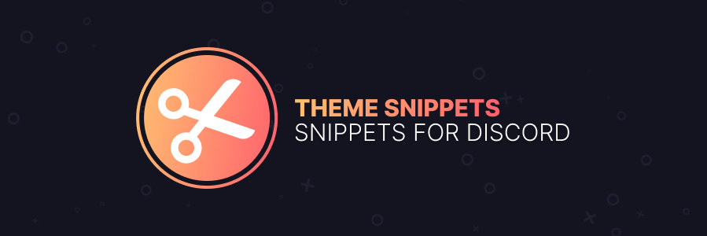

# Snippets for Discord
Some simple, free to use, CSS/SCSS snippets for Discord client mods, such as:
- **[Stylus](https://github.com/openstyles/stylus)**, which is available on **[Chrome](https://chrome.google.com/webstore/detail/stylus/clngdbkpkpeebahjckkjfobafhncgmne)** / **[Firefox](https://addons.mozilla.org/en-US/firefox/addon/styl-us/)** / **[Opera](https://github.com/openstyles/stylus/wiki/Opera,-Outdated-Stylus)**
- **[BetterDiscord](https://betterdiscord.net/)**
- **[Powercord](https://powercord.dev/)**
- **[Vizality](https://vizality.com/)** 
- **[Goosemod](https://goosemod.com/)** (most likely)

# How does this work?
Most of the snippts allow the users to easily apply them, whether they copy-paste the code into their Quick CSS, or installing as if it's a theme. However, some snippets are meant **strictly** for enhancing themes, such as [Snapper's](https://github.com/Snapperito) **[Theme Warnings](https://github.com/Snippets-For-Discord/theme-warnings)**.

It is also highly recommended to use the snippets locally, and not importing from githubusercontent / githack links. Everything is fairly customizable, and it's better to use this type of practice anyways since it's a much smoother experience.

All snippets will have a CSS and SCSS version, so if CSS isn't your style, there's SCSS versions you can use as well so you don't have to convert them over.

# Suggesting Snippets
If you have an idea for a snippet and want it to become a reality, make a pull request on this repo, following the format given as well as explaining to the best of your ability of what kind of snippet you'd like to see. Note that since everything is CSS only, some things won't be possible to create depending on what it is.

# Issues & Enhancements
If you run into any issues with a specific snippet, or just want to enhance it by adding a feature or making it function better, feel free to make an issue request on the specific snippet. If you want to take matters into your own hands instead, feel free to make a pull request fixing any issues or adding an enhancement to a snippet.